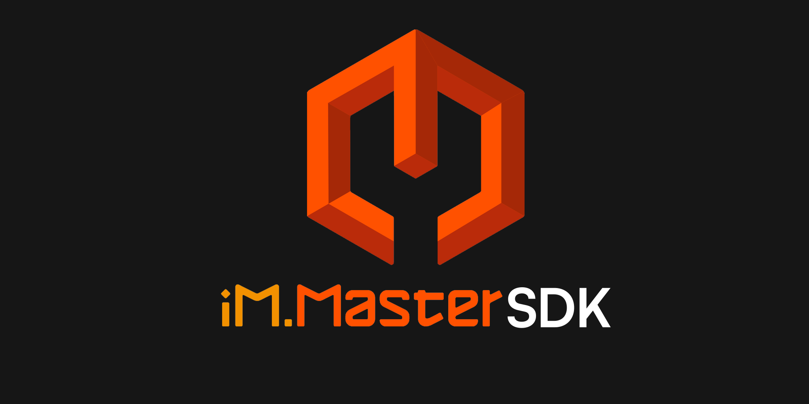
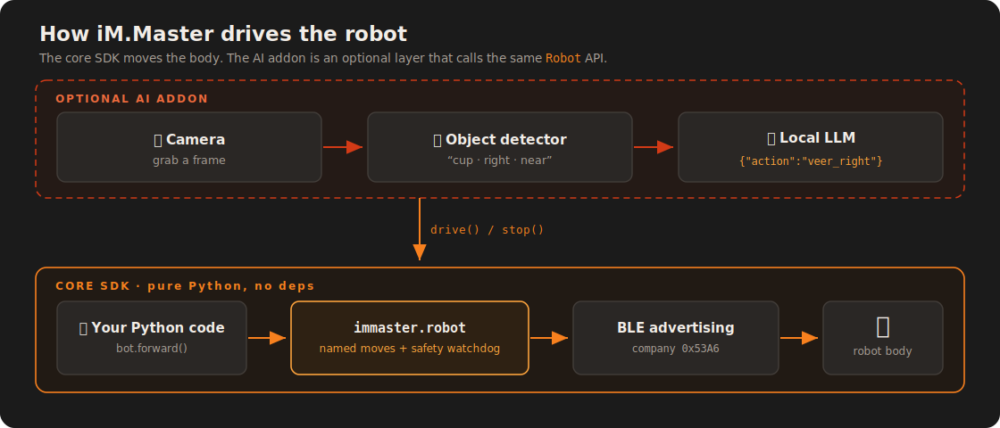
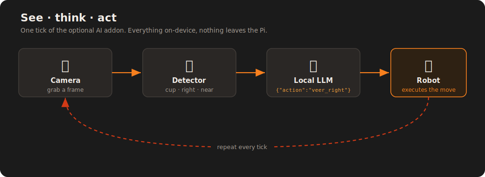
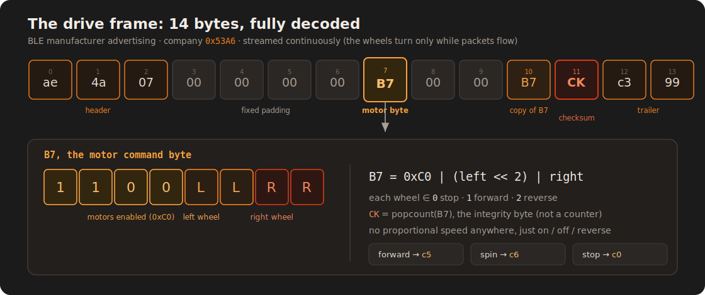

<div align="center">

# iM.Master SDK

### A Python SDK for a reverse-engineered BLE robot.

**Drive the iM.Master robot from Python.** <br> No vendor app, no pairing, no cloud.
If you want, hand the wheel to a local LLM, and give it some eyes.

[](LICENSE)
[](https://www.python.org/downloads/)
[](docs/BLUETOOTH.md)
[](docs/BLUETOOTH.md)
[](CONTRIBUTING.md)


</div>

---

## Table of contents

- [What is this?](#what-is-this)
- [Highlights](#highlights)
- [Install](#install)
- [Quickstart: drive from Python](#quickstart-drive-from-python)
- [Tutorial: the AI addon, start to finish](#tutorial-the-ai-addon-start-to-finish)
- [Choosing your LLM backend](#choosing-your-llm-backend)
- [Which robots does this work with?](#which-robots-does-this-work-with)
- [The SDK, module by module](#the-sdk-module-by-module)
- [The protocol](#the-protocol)
- [Project layout](#project-layout)
- [Testing](#testing)
- [Troubleshooting](#troubleshooting)
- [Contributing](#contributing)
- [Safety and responsible use](#safety-and-responsible-use)
- [License](#license)

---

## What is this?

The iM.Master is a toy robot that ships with nothing but a phone app. No remote,
no API, no docs. This SDK pulls apart the Bluetooth its app speaks and rebuilds the
whole control path in Python, so you can drive the robot from code:

```python
from immaster.robot import Robot

with Robot() as bot:
    bot.for_duration("forward", 2.0)   # forward for 2 seconds, then auto-stop
    bot.spin_cw()                      # spin in place
    bot.stop()
```

So the main thing here is a plain Python interface to the robot. The core has no
dependencies. It's pure standard library.

There's also an optional AI addon. Point something like an old phone at the robot
as a camera, run object detection on the Pi, and let a small local LLM decide how
to move. The robot can go find a cup and drive to it, and all of it runs on the
device.

<div align="center">
  
</div>


---

## Highlights

- 🔓 **Real reverse-engineered protocol.** BLE legacy advertising, company id
  `0x53A6`, a 14-byte differential-drive frame with a popcount checksum. Decoded
  from an actual packet capture and written up in full in
  [docs/BLUETOOTH.md](docs/BLUETOOTH.md).
- 🐍 **Plain Python API.** `Robot().forward()`, `spin_cw()`, `for_duration(...)`.
  Named moves, direct wheel control, continuous drive.
- 🛡️ **Safety watchdog.** If your control loop stalls or crashes, the robot stops
  on its own instead of driving into a wall.
- 🧩 **No-dependency core.** Protocol and robot control use only the standard
  library. The AI extras are opt-in.
- 🔌 **Swappable parts.** The LLM backend, the camera, and the detector are each a
  small interface, so you can bring Ollama or llama.cpp, a phone or a Pi Camera.
- 💻 **Works without hardware.** `DryRobot` and `IMMASTER_DRY_RUN=1` let you run the
  whole thing, LLM loop included, on a laptop.

<br>


(freed bot is a happy-spinny bot!)

---

## Install

You can use pip: (confirm version on [PyPI](https://pypi.org/project/immaster-sdk/0.1.0/))
```bash
pip install immaster-sdk
```


Or clone the repository.

```bash
git clone https://github.com/2alf/immasterSDK.git
cd immasterSDK
pip install -e .              # core SDK: pure standard library, no dependencies

pip install -e ".[vision]"    # optional AI addon (Pillow + numpy for camera/detection)
pip install -e ".[dev]"       # tests
```

> **Where things run:** the pure protocol layer runs anywhere (Windows, macOS,
> Linux). Moving the actual robot needs raw BLE HCI, which is Linux only, in
> practice a Raspberry Pi run as root. On Windows or macOS you can still decode
> frames, wire up the LLM loop, and run the tests.

---

## Quickstart: drive from Python

### 1. Build and decode frames (anywhere, no hardware)

```python
from immaster.protocol import build_frame, decode_frame, Wheel

build_frame(Wheel.FWD, Wheel.FWD).hex()          # 'ae4a0700000000c50000c504c399'  (forward)
decode_frame(bytes.fromhex('ae4a0700000000c90000c904c399'))  # (Wheel.REV, Wheel.FWD)  (spin)
```

### 2. Drive the robot (on the Pi, as root)

```python
from immaster.robot import Robot

with Robot() as bot:
    bot.for_duration("forward", 2.0)   # scripted: forward for 2s, then auto-stop
    bot.spin_cw()                      # continuous: keeps spinning...
    bot.keepalive()                    # ...refresh the watchdog to hold it
    bot.set_wheels(1, 0)               # raw per-wheel control (left fwd, right stop)
    bot.stop()
```

Run it as root, since raw BLE needs it:

```bash
sudo -E python3 my_script.py
```

Movement is stateful and continuous. A call like `spin_cw()` sets the current
command and returns right away, and a background thread keeps broadcasting it. The
watchdog stops the robot if nothing refreshes the command within about 1.5s.

The named moves are `forward`, `reverse`, `spin_cw`, `spin_ccw`, `veer_left`,
`veer_right`, `back_left`, `back_right`, and `stop`. Each wheel is only on, off, or
reverse. There is no proportional speed. That's how the robot's protocol works, not
a limit of the SDK.

### 3. Drive it with a local LLM

You don't need a camera or any vision hardware to let a model steer. Here's the
whole AI loop in about 15 lines, using [Ollama](https://ollama.com) or any other
backend:

```python
import json
from immaster.robot import Robot
from immaster.llm import make_llm
from immaster import agent

llm = make_llm("ollama")          # or "hailo" / "openai"
messages = [{"role": "system", "content": agent.SYSTEM_PROMPT},
            {"role": "user", "content": "Goal: drive forward briefly, then spin. First action?"}]

with Robot() as bot:
    for _ in range(8):
        reply = llm.chat(messages)
        action = agent.parse_action(reply)          # pull one JSON action out of the reply
        if not action:
            continue
        result = agent.dispatch_action(bot, action)  # execute it on the robot
        messages += [{"role": "assistant", "content": reply},
                     {"role": "user", "content": f"Result: {json.dumps(result)}. Next action, or stop."}]
        if action.get("action") == "stop" or action.get("tool") == "stop":
            break
```

Add a camera and a detector on top of this and you get the full see-think-act loop
from the next section.

---

## Tutorial: the AI addon, start to finish

This is the exact setup the project ran end to end: an old phone as the robot's
eyes, object detection on the Pi, and a small local LLM picking moves.

<div align="center">
  
</div>

**What you'll need**

- The iM.Master robot 🤖
- A Raspberry Pi running Raspberry Pi OS (64-bit). Robot control is Linux only.
- A camera, for example an old phone (Android or iOS) with an IP-camera app. This was built with
  [IP Webcam](https://play.google.com/store/apps/details?id=com.pas.webcam) on Android.
- A local LLM runtime: [Ollama](https://ollama.com) (easiest) or Hailo-Ollama.
- Optional, for object detection: a Hailo AI HAT+2 (Hailo-10H) with the Hailo SDK
  installed. Without it you can still do the LLM-only drive from
  [Quickstart step 3](#quickstart-drive-from-python).

**Step 1. Get the code onto the Pi**

```bash
git clone https://github.com/2alf/immasterSDK.git
cd immasterSDK
python3 -m venv .venv && source .venv/bin/activate
pip install -e ".[vision]"
```

**Step 2. Confirm you can drive the robot (no AI yet)**

```bash
sudo -E python3 -c "from immaster.robot import Robot; b=Robot(); b.for_duration('forward',1.5); b.close()"
```

The robot should roll forward for about 1.5s and stop. If it doesn't, check
[Troubleshooting](#troubleshooting) before adding anything else.

**Step 3. Turn the phone into the robot's eyes**

1. Install an IP-camera app and start its server. Note the snapshot URL. For IP
   Webcam it's `http://<phone-ip>:8080/shot.jpg` (add `user:pass@` if you set a login).
2. Mount the phone on the robot, facing forward.
3. Test the feed from the Pi:

```bash
export IPCAM_URL="http://user:pass@<phone-ip>:8080/shot.jpg"
python3 -c "from immaster.camera import IPCamera; print('got', len(IPCamera().capture() or b''), 'bytes')"
```

A non-zero byte count means the eyes work.

**Step 4. Put a brain on the Pi (Ollama)**

```bash
curl -fsSL https://ollama.com/install.sh | sh
ollama pull qwen2.5:1.5b
```

Prefer a model running on the Hailo NPU instead? See
[Choosing your LLM backend](#choosing-your-llm-backend).

**Step 5. Object detection on the Hailo NPU (optional)**

YOLO detection uses HailoRT (`hailo_platform`) plus a YOLO `.hef` model. Both come
with the Hailo SDK (`sudo apt install hailo-h10-all`). The default model path is
`/usr/share/hailo-models/yolov11m_h10.hef` (override with `HAILO_HEF`). This is the
one piece that isn't on PyPI. No Hailo? Use the LLM-only drive from
[Quickstart step 3](#quickstart-drive-from-python) instead.

**Step 6. Dry-run the whole loop (no movement)**

```bash
IMMASTER_DRY_RUN=1 python3 -m examples.find_and_go --backend ollama "find a cup"
```

You'll see the detections and the moves the model picks printed to the terminal,
without touching the robot. It's a good way to check that the camera, detector, and
LLM all talk to each other before anything rolls.

**Step 7. Let it drive for real**

```bash
sudo -E python3 -m examples.find_and_go --backend ollama --voice --monitor \
    "find a cup and go to it"
```

- Open `http://<pi-ip>:8090` on the phone and tap *Enable voice* to hear the robot
  narrate.
- `Ctrl+C` stops cleanly at any time, and the robot always ends stopped.

And that's it: a cheap toy that sees, decides, and drives itself, offline.

---

## Choosing your LLM backend

The brain is a swap. You're not locked to one runtime. Pick it with `--backend` (or
the `LLM_BACKEND` env var):

```bash
python3 -m examples.find_and_go --backend ollama  "find a cup"   # real Ollama (CPU/GPU)
python3 -m examples.find_and_go --backend hailo   "find a cup"   # a model on the Hailo NPU
python3 -m examples.find_and_go --backend openai  "find a cup"   # llama.cpp / LM Studio / vLLM
```

In code it's the same idea:

```python
from immaster.llm import make_llm

llm = make_llm("hailo")                 # or "ollama", or "openai"
reply = llm.chat([{"role": "user", "content": "..."}])
```

| Backend | Targets | Default endpoint | Env override |
|---------|---------|------------------|--------------|
| `ollama` | real Ollama (CPU/GPU) | `http://localhost:11434` | `OLLAMA_HOST`, `LLM_MODEL` |
| `hailo` | Hailo-Ollama (model on the NPU) | `http://localhost:8000` | `HAILO_HOST`, `LLM_MODEL` |
| `openai` | llama.cpp / LM Studio / vLLM | `http://localhost:11434/v1` | `LLM_BASE`, `LLM_MODEL`, `LLM_API_KEY` |

Both Ollama (CPU or GPU) and Hailo-Ollama (a model on the NPU) are first-class. The
project ran on Hailo-Ollama first and real Ollama later, and both work. `openai`
covers any OpenAI-compatible local server. Need a runtime that isn't listed?
Subclass `LLMBackend` in [`immaster/llm.py`](immaster/llm.py), implement `chat()`,
and register it.

---

## Which robots does this work with?

The protocol was decoded from one physical robot, so here's the honest scope:

- **Same product model: almost certainly.** The control scheme lives in the
  robot's firmware. It's a fixed BLE company id (`0x53A6`), a fixed frame layout,
  and a connectionless broadcast with no pairing and no device address. Any robot
  on the same firmware reacts to the same frames. Nothing here is tied to one
  unit's serial or MAC.
- **One side effect.** Since it's an untargeted broadcast, it drives every robot of
  this model in BLE range at once. There's no way to talk to just one. That's how
  the toy works, not a bug here.
- **What can differ per unit.** Wheel orientation, meaning which motor is "left"
  and whether forward is forward. If yours drives mirrored or backwards, flip the
  mapping in the `COMMANDS` table in [`immaster/protocol.py`](immaster/protocol.py).
- **Other or rebranded iM.Master variants: not tested.** A different hardware
  revision could use a different company id or frame format. If yours doesn't
  respond, capture its traffic and compare it against
  [docs/BLUETOOTH.md](docs/BLUETOOTH.md), which doubles as a porting guide.

So: this targets the iM.Master it was decoded from, should work on other units of
the same model, and has only been confirmed on the author's robot.

---

## The SDK, module by module

**Core, moving the robot (pure standard library):**

| Module | Runs where | Purpose |
|--------|-----------|---------|
| [`protocol.py`](immaster/protocol.py) | anywhere | Pure frame / checksum logic. No BLE. Unit-testable. |
| [`driver.py`](immaster/driver.py) | Pi (root) | Raw HCI transport and the continuous-advertising broadcaster thread. |
| [`robot.py`](immaster/robot.py) | Pi (root) | High-level `Robot` API: named movements and the safety watchdog. |
| [`testing.py`](immaster/testing.py) | anywhere | `DryRobot` stand-in for off-hardware testing. |

**Optional AI addon, letting a local model drive.** Every moving part is a
pluggable component behind a small interface, so you can drop in your own:

| Module | Interface → built-in | Purpose |
|--------|----------------------|---------|
| [`llm.py`](immaster/llm.py) | `LLMBackend` → Ollama / Hailo-Ollama / OpenAI-API | The brain. Pick a backend or write your own. |
| [`camera.py`](immaster/camera.py) | `Camera` → `IPCamera`, `StaticImage` | The eyes' input. Phone webcam, a file, or your own source. |
| [`detect.py`](immaster/detect.py) | `ObjectDetector` → `Detector` (Hailo YOLO) | Turns a frame into detections. Swap in any model. |
| [`agent.py`](immaster/agent.py) | | JSON-action tool specs, prompt, parser, and dispatcher. |
| [`personas.py`](immaster/personas.py) | | Persona prompt layer over the strict control contract. |
| [`vision.py`](immaster/vision.py) | | Image helpers: brightness and "am I stuck?" frame-change cues. |
| [`voice.py`](immaster/voice.py)  | | Spoken output (browser audio output). |

Each interface is one method. To add a brain, subclass `LLMBackend` and implement
`chat(messages) -> str`. For a camera, subclass `Camera` and implement
`capture() -> bytes`. For a detector, subclass `ObjectDetector` and implement
`detect(jpeg) -> list[dict]`. The loop calls the interface, so any implementation
works without touching it.

The rule that keeps this clean: `protocol.py` never touches hardware, so you can
build and decode frames on any machine. Everything BLE-facing sits behind
`driver.py`.

---

## The protocol

The robot isn't controlled over GATT. It's driven by BLE manufacturer-specific
advertising packets sent continuously. The wheels turn only while the packets keep
coming.

<div align="center">
  
</div>

Each wheel is on, off, or reverse. There is no proportional speed anywhere in the
protocol. That's the whole control surface, and it still gives clean differential
drive: forward, reverse, spin in place, and arcing turns.

The full write-up is in [docs/BLUETOOTH.md](docs/BLUETOOTH.md).

> **A note on maturity.** The core SDK (protocol, driver, robot) is solid and
> confirmed on hardware. The AI addon is real and ran end to end, but detection is
> only as good as a small YOLO model, and the brain is a small local LLM picking
> from a handful of moves. It's a fun build, not a self-driving car.

---

## Project layout

```
immaster/            the SDK
  protocol.py        pure frame/checksum logic (core, no BLE)
  driver.py          raw HCI + continuous-advertising broadcaster (core, Pi)
  robot.py           high-level Robot API + watchdog (core, Pi)
  testing.py         DryRobot for off-hardware runs
  llm.py             LLM backends                                   ┐
  camera.py          Camera sources (IPCamera, ...)      │
  detect.py          ObjectDetector + Hailo YOLO         │
  agent.py           JSON-action LLM dispatch              ├─ optional addon
  personas.py        persona prompt layer                      │
  vision.py          image cues (brightness, stuck)          │
  voice.py           voice out                                            ┘
examples/
  find_and_go.py     the working see-think-act loop (camera + detection + local LLM)
docs/
  BLUETOOTH.md       full protocol reverse-engineering write-up
  assets/            README diagrams (SVG)
tests/               pure-logic unit tests (protocol, agent, llm, camera; no hardware)
```

---

## Testing

```bash
pip install -e ".[dev]"
pytest -q
```

The tests cover the protocol, the LLM dispatch logic, backend selection, and the
camera layer. All pure, no hardware, and green in CI on Python 3.10 to 3.12.

---

## Troubleshooting

| Symptom | Cause and fix |
|---------|---------------|
| `PermissionError: raw HCI requires root` | Run with `sudo -E python3 ...`. Raw BLE needs root, and `-E` keeps your env vars. |
| `RuntimeError: HciBroadcaster only runs on Linux` | You're not on Linux. The robot only drives from a Pi or other Linux box. Decoding frames, the LLM loop, and the tests all run anywhere. |
| Script runs, **robot doesn't move** | (1) Another iM.Master in range is reacting too. It's a broadcast, so that's expected. (2) Your unit's wheels are mirrored; adjust the `COMMANDS` table in [`immaster/protocol.py`](immaster/protocol.py). (3) Make sure nothing else is holding `hci0`. |
| `camera unreachable` / `capture()` returns `None` | Check `IPCAM_URL`, that the phone's camera app is running, that both are on the same LAN, and that any `user:pass@` login is in the URL. |
| LLM `Connection refused` / timeout | Start the runtime: `ollama serve` and `ollama pull <model>` for `--backend ollama`, or a Hailo-Ollama server on `:8000` for `--backend hailo`. Check `OLLAMA_HOST` / `HAILO_HOST`. |
| `ModuleNotFoundError: hailo_platform` or `Detector()` fails | HailoRT isn't installed. Install the Hailo SDK (`sudo apt install hailo-h10-all`), or skip detection and use the LLM-only drive from [Quickstart step 3](#quickstart-drive-from-python). |
| Model returns no action or repeats itself | A small-model quirk; the loop nudges it. Try a different `LLM_MODEL` or fewer steps. |
| Move gets cut short | The watchdog stops after about 1.5s without a refresh. Use `for_duration()`, which refreshes for you, or call `keepalive()` in your loop. |

---

## Contributing

Contributions are welcome: new example behaviors, support for other
advertising-driven BLE robots, new backends, cameras, or detectors, and perception
improvements. See [CONTRIBUTING.md](CONTRIBUTING.md) and the
[Code of Conduct](CODE_OF_CONDUCT.md).

---

## Safety and responsible use

This documents an interoperable control path for a robot you own, for learning and
tinkering. Remember that the broadcast drives every robot of this model in range.
Drive in open space, keep the watchdog on, and watch autonomous runs.

---

## License

[MIT](LICENSE). Do what you want, no warranty. Not affiliated with or endorsed by
the makers of the iM.Master robot. The name is used only to identify the hardware
this SDK talks to.
