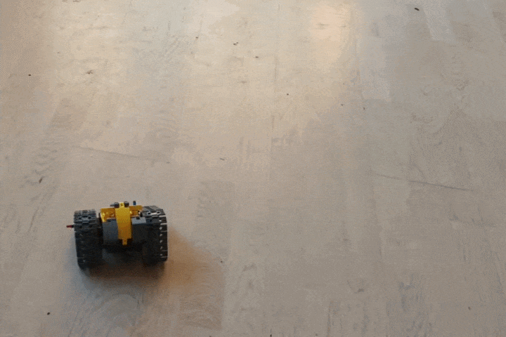

# iM.Master - Bluetooth Reverse Engineering

A complete account of how the im.master robot is controlled over Bluetooth, how
the protocol was decoded, and the exact frame format.

---

## 1. Summary

The robot is **not** controlled via BLE GATT (no connections, no
characteristics). It is driven entirely through **BLE manufacturer-specific
advertising packets**. The controller never pairs or connects it just
broadcasts advertisements with a specific manufacturer payload, and the robot
acts on them while they're being transmitted.

| Fact | Value |
|------|-------|
| Transport | BLE **legacy advertising** (not GATT, not extended adv) |
| Data carrier | Manufacturer-specific data AD structure (type `0xFF`) |
| Company ID | **`0x53A6`** little-endian on the wire: `a6 53` |
| Payload length | 14 bytes |
| Movement requirement | Advertising must be **streamed continuously** to keep moving |
| Platform that works | Linux raw HCI (Raspberry Pi). Windows + Bleak **cannot** emit these packets. |

---

## 2. How the transport was found

Early attempts assumed GATT and failed. The breakthrough came from capturing the
**real vendor app** driving the robot (`btsnoop_hci.log`) and noticing all the
relevant traffic was **advertising data**, not connection traffic. Every control
packet carried a manufacturer AD structure under an unassigned company ID
(`0x53A6`).

Replaying those captured advertising frames from a Raspberry Pi (raw HCI) made
the robot's LED go solid and when the frames were streamed in a loop **made
the wheels move**. That confirmed:

- BLE transport = advertising (correct),
- manufacturer-data format = correct,
- the remaining work was purely **decoding the command bytes**.

### HCI specifics (Raspberry Pi / Linux)
- `LE Set Advertising Data` = opcode `0x08|0x0008`
- `LE Set Advertise Enable` = opcode `0x08|0x000a`
- Legacy advertising (`0x0008`) is sufficient; **extended advertising is not
  required**.
- Re-enabling advertising repeatedly (per frame) is tolerated by the robot.
- The 31-byte adv-data buffer is: `02 01 05` (flags) · `len 0xFF a6 53` (manuf
  header) · 14-byte payload · zero-padded to 31.

---

## 3. The frame format

Manufacturer payload: **14 bytes**:

```
ae 4a 07 00 00 00 00  B7  00 00  B7  CK  c3 99
└─ header ──┘          │        │    │   └ trailer ┘
                       │        │    └ CK  = popcount(B7)  (integrity byte)
                       │        └ byte10 = copy of B7 (mirror)
                       └ B7 = motor command byte
```

| Offset | Bytes | Meaning |
|--------|-------|---------|
| 0–2 | `ae 4a 07` | Fixed header / "active drive profile" |
| 3–6 | `00 00 00 00` | Fixed padding |
| 7 | `B7` | **Motor command byte** (see below) |
| 8–9 | `00 00` | Fixed padding |
| 10 | `B7` | Copy of byte 7 (redundant mirror) |
| 11 | `CK` | **Checksum** = `popcount(B7)` (number of set bits) |
| 12–13 | `c3 99` | Fixed trailer |

**Idle / neutral beacon** (broadcast when not actively driving) differs in header
and trailer:
```
ae 00 00 00 00 00 00 00 00 00 00 00 e1 99
```

---

## 4. The motor command byte (B7)

`B7 = 0xC0 | (left << 2) | right`

- The high bits `0xC0` are a constant **motors-enabled** flag (present in every
  observed frame).
- The low nibble splits into **two 2-bit fields**: left wheel and right wheel.
- Each wheel state is one of: **`0` = stop, `1` = forward, `2` = reverse**
  (the value `3`/`11b` never appears).

```
 bit:  7 6 5 4 3 2 1 0
       1 1 0 0 L L R R
       └enable┘ │   └ right wheel (00/01/10)
                └ left wheel (00/01/10)
```

This is a clean **differential-drive** encoding. All 9 combinations:

| B7 | L | R | CK | meaning | frame |
|----|---|---|----|---------|-------|
| `c0` | 0 | 0 | 02 | stop | `ae4a0700000000c00000c002c399` |
| `c5` | 1 | 1 | 04 | forward | `ae4a0700000000c50000c504c399` |
| `ca` | 2 | 2 | 04 | reverse | `ae4a0700000000ca0000ca04c399` |
| `c6` | 1 | 2 | 04 | spin (L fwd, R rev) | `ae4a0700000000c60000c604c399` |
| `c9` | 2 | 1 | 04 | spin (L rev, R fwd) | `ae4a0700000000c90000c904c399` |
| `c4` | 1 | 0 | 03 | veer / left wheel only fwd | `ae4a0700000000c40000c403c399` |
| `c1` | 0 | 1 | 03 | veer / right wheel only fwd | `ae4a0700000000c10000c103c399` |
| `c8` | 2 | 0 | 03 | left wheel only rev | `ae4a0700000000c80000c803c399` |
| `c2` | 0 | 2 | 03 | right wheel only rev | `ae4a0700000000c20000c203c399` |

> **No proportional speed.** Each wheel is strictly on/off/reverse there is no
> speed magnitude anywhere in the protocol. (An earlier controller draft assumed
> a 0–255 speed byte; that model is wrong.)

---

## 5. The checksum (byte 11)

Byte 11 was initially mistaken for a **sequence counter**. Parsing the capture
overturned that: byte 11 is **fully deterministic from byte 7** ::: every `c0`
frame has `CK=02`, every `c4` has `03`, every `ca` has `04`, etc.

The formula is simply the **population count (number of set bits) of B7**:

```
CK = popcount(B7)
```

Verified against all 587 manufacturer frames in the capture - it holds for every
one, including turn frames where the two wheel fields differ.

**Practical consequence:** a frame with a wrong checksum is ignored (or only
partially acted on). An early replay script included the frame
`ae4a0700000000dc0000dc7cc399` but `popcount(0xdc)=5`, not `0x7c`, so that
frame was invalid, which is why replaying it produced erratic single-wheel
behavior. Once frames are generated with the correct `popcount` checksum, motion
is reliable.

---

## 6. How the semantics were mapped (the capture timeline)

The capture (`btsnoop_hci.log`) was a real driving session. Collapsing the 587
frames into runs and looking at *durations* revealed the command meanings:

- The **sustained** frames (held for hundreds of ms to seconds) are the real
  commands: `c5` (forward), `ca` (reverse), `c6`/`c9` (spins).
- The **brief ~30 ms blips** (`c4`, `c8`) that always immediately precede a
  sustained command are the app **ramping the left wheel one step before the
  right joins** an artifact of the app, not separate commands. (This is also
  why partial/looped replays showed "only one wheel moves in a direction.")

Only 9 distinct frames appear in the entire session exactly the 9 combinations
of the two ternary wheel fields, confirming the dual-2-bit-field model.

---

## 7. Reference implementation

The decoded protocol is implemented in **`immaster/protocol.py`** (pure, no BLE,
testable anywhere) and driven over the air by **`immaster/driver.py`** (raw HCI
broadcaster). Key helpers:

```python
from immaster.protocol import build_frame, decode_frame, Wheel

build_frame(Wheel.FWD, Wheel.FWD).hex()   # -> 'ae4a0700000000c50000c504c399'  (forward)
decode_frame(bytes.fromhex('ae4a0700000000c90000c904c399'))  # -> (REV, FWD)  (spin)
```

The tests in `tests/test_protocol.py` exercise this logic and double as an
executable spec of the frame format.

---

## 8. Status

| Item | State |
|------|-------|
| BLE transport (advertising) | ✅ Solved |
| Manufacturer format / company ID | ✅ Solved |
| Frame byte layout | ✅ Fully decoded |
| Motor command encoding (differential drive) | ✅ Fully decoded |
| Checksum (popcount) | ✅ Solved |
| Physical orientation (which wheel = left, fwd vs rev) | ✅ Confirmed on robot |
| Proportional speed | ❌ Does not exist in protocol |

The protocol is considered **fully reverse-engineered**.


## SO ALL IN ALL THE ROBOT IS FREEEEEE!!!!!!

